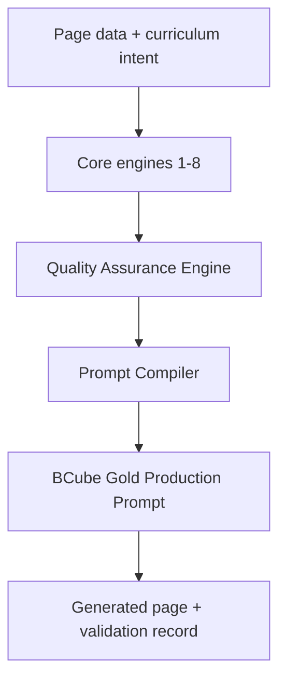
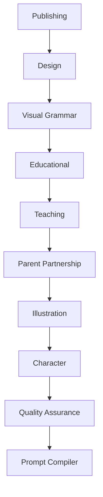

# BCube Prompt Engine v3.0 architecture

## Compilation order

Rules inherit from global to book to unit to page. More specific overrides are accepted only when their authority, rationale, and compatibility are valid and recorded.
