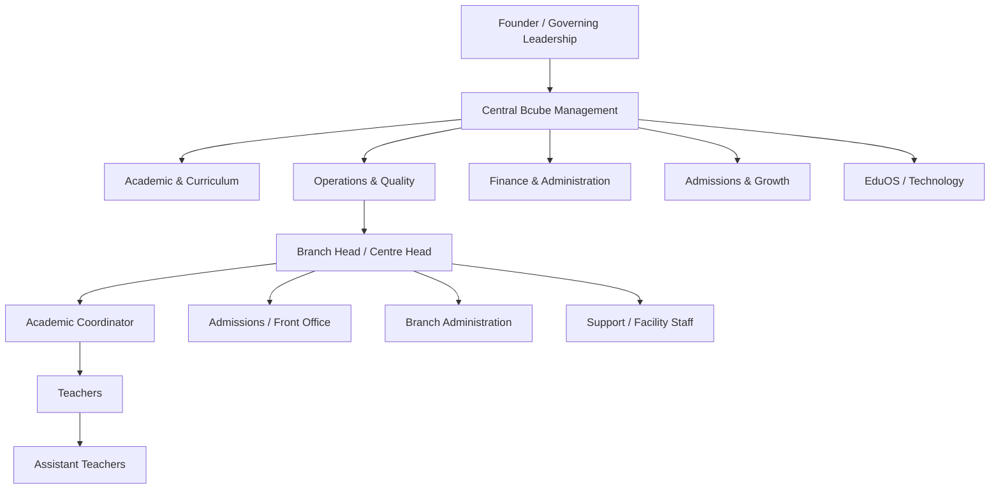

# Organization Architecture & RACI

**Status:** Draft v0.1

## Objective

Define clear accountability from central Bcube leadership to branch execution so the preschool can scale without role ambiguity.

## Reference organization

## Core accountabilities

| Role | Primary accountability |
|---|---|
| Governing Leadership | Strategy, major policy, investment and risk appetite |
| Central Management | Operating standards, branch performance and cross-functional governance |
| Academic Lead | Curriculum, pedagogy, assessment and teacher quality |
| Operations / Quality Lead | SOPs, audits, safety controls and branch operating consistency |
| Finance Lead | Fees, financial controls, budgets and reporting |
| Admissions / Growth Lead | Lead funnel, counselling standards, conversion and retention support |
| Technology / EduOS Lead | Digital capabilities, data, access and operational technology |
| Branch Head | Accountable for safe, compliant and effective daily branch operation |
| Academic Coordinator | Academic execution, lesson readiness and classroom quality |
| Teacher | Child learning, observation, classroom safety and parent-facing academic inputs |
| Assistant Teacher | Classroom support, supervision and routine execution |
| Admissions / Front Office | Enquiry, visit, records and parent coordination |
| Branch Administration | Records, fees support, inventory, vendors and facility coordination |

## RACI — core operating processes

R = Responsible · A = Accountable · C = Consulted · I = Informed

| Process | Central | Branch Head | Academic Coordinator | Teacher | Admissions/Admin | Finance |
|---|---|---|---|---|---|---|
| Annual operating plan | A/R | C | C | I | C | C |
| Academic calendar | C | C | A/R | I | I | I |
| Weekly lesson planning | I | I | A | R | I | I |
| Classroom delivery | I | C | A | R | I | I |
| Enquiry & counselling | C | A | I | I | R | I |
| Admission approval / completion | I | A | I | I | R | C |
| Student onboarding | I | A | C | R | R | I |
| Daily attendance | I | A | C | R | C | I |
| Authorized dispersal | I | A | C | R | C | I |
| Parent academic review | I | C | A | R | I | I |
| Parent complaint | C | A | C | C | R | I |
| Safety incident response | C | A/R | C | R | C | I |
| Fee collection control | I | C | I | I | R | A |
| Procurement | C | R | I | I | R | A/C |
| Branch audit | A/R | C | C | I | C | C |

## Delegation principle

Delegation transfers execution authority, not accountability. Safety, safeguarding, financial approvals and sensitive-data access must use explicit authority limits rather than informal delegation.

## Escalation levels

1. **L1 — Operational:** executor / teacher / administrator resolves within SOP.
2. **L2 — Branch:** Branch Head resolves cross-role, parent or branch-control issues.
3. **L3 — Central function:** academic, operations, finance, technology or safeguarding expertise required.
4. **L4 — Governing leadership:** material safety, legal, reputation, financial or strategic risk.

Detailed authority thresholds will be maintained in a future Delegation of Authority matrix.
