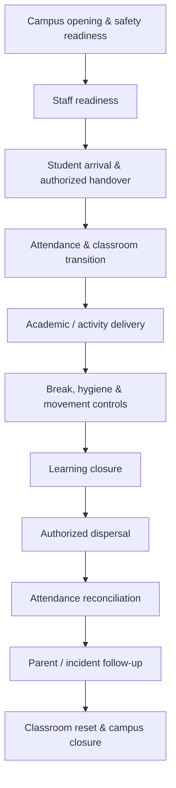

# Preschool Operating Model

**Status:** Foundation v0.1

## Objective

Define a repeatable operating system that delivers consistent learning quality, child safety, parent experience and business control across Bcube Future Preschool branches.

## Operating domains

1. School leadership and governance
2. Admissions and parent onboarding
3. Academic operations
4. Student operations
5. Parent experience
6. People and teacher operations
7. Child safety, health and safeguarding
8. Finance and administration
9. Facilities, procurement and inventory
10. Technology, data and communication
11. Quality management and continuous improvement

## Daily operating cycle

## Management rhythm

### Daily

- Student and staff attendance
- Safety / health incidents
- Parent issues requiring action
- Enquiries, visits and admissions
- Fee exceptions
- Facility and operational blockers

### Weekly

- Admissions funnel and conversion
- Classroom quality and teacher observations
- Attendance trends
- Parent concerns
- Curriculum progress
- Open corrective actions
- Upcoming events and operational readiness

### Monthly

- Enrolment and retention
- Fee collection and outstanding fees
- Academic progress
- Parent satisfaction
- Teacher performance and training
- Safety and operational audit results
- Expenses and budget variance
- Branch scorecard

## Control model

Every core process should define:

`Owner → Trigger → Inputs → Procedure → Controls → Evidence → SLA → Exception → Escalation → KPI`

## Branch consistency

Central standards define the minimum operating baseline. A branch may add a local procedure where required, but it must not weaken child safety, safeguarding, academic quality, financial control, data protection or approved brand standards.
