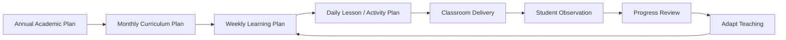

# Bcube Future Preschool — Academic Operating System

**Status:** Draft v0.1  
**Owner:** Academic Head / Branch Academic Coordinator

## Purpose

Create a consistent academic operating rhythm that converts approved curriculum into high-quality daily classroom experiences, observable learning progress, actionable teacher feedback and clear parent communication.

## Academic operating cycle

## Planning layers

### Annual
- Academic calendar
- programme-level learning priorities
- curriculum sequencing
- major assessments / progress review windows
- teacher development calendar
- parent engagement milestones
- events and celebrations with academic relevance

### Monthly
- learning outcomes and themes
- book / module coverage
- core activity set
- materials readiness
- assessment / observation focus
- remediation and enrichment priorities

### Weekly
- daily learning objectives
- activity sequence
- required materials
- differentiation / support notes
- observation targets
- home connection where applicable

### Daily
- child-facing objective
- warm-up / welcome
- guided activity
- independent / small-group practice
- observation point
- reflection / closure
- materials reset and teacher note

## Quality principle

Coverage alone is not success. Bcube should track whether planned learning was delivered, whether children engaged meaningfully, whether the intended evidence was observable, and whether teaching was adapted when children needed different support.
