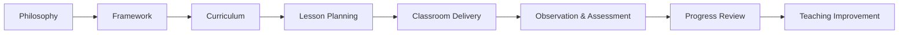

# Academic Architecture

**Status:** Foundation / to be elaborated

## Purpose

Define how Bcube converts its educational philosophy into consistent classroom experiences and observable learning outcomes.

## Architecture areas

- Learning philosophy
- Nursery / LKG / UKG level architecture
- Learning domains
- Future Skills framework
- Teaching methodology
- Activity-based learning
- Lesson planning
- Classroom routines
- Assessment framework
- Learning outcomes
- Teacher guidance
- Classroom observation
- Academic calendar
- Home connection

## Relationship to repository curriculum assets

The existing repository `curriculum/` directory remains a source for curriculum artifacts. This section documents the **school-level academic operating architecture** and should link to curriculum source material rather than copying it.

