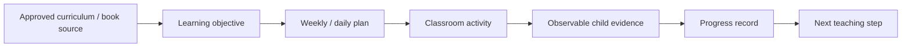
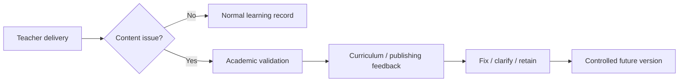

# BCube Future Skills Learning Series™ — Preschool Delivery Map

**Status:** Draft architecture

## Purpose

Connect Bcube's curriculum/publishing intellectual property to actual preschool classroom operations without duplicating the authoritative source assets already maintained elsewhere in the repository.

## Delivery model

## Series-to-school integration

The preschool programme can draw from approved Bcube series including, where applicable by level and final curriculum map:

- Communication Champions
- Early Maths Adventures
- Creative Design Studio
- Digital Explorers
- Healthy Me & Wellbeing
- Financial Literacy & Life Skills
- My Amazing World
- Creativity Challenges

The exact level/book/page mapping must come from the approved curriculum source, not from this operational document.

## Classroom rule

A book page is a **learning asset**, not automatically the entire lesson. Teachers should understand:

1. the intended learning objective;
2. the child action;
3. prerequisite explanation/modelling;
4. practical or oral experience needed before/during the page;
5. observable evidence;
6. follow-up or extension.

## Traceability

Recommended planning reference:

`Programme → Series → Book → Version → Page/Activity ID → Learning Objective → Lesson Plan → Observation/Progress`

Where stable IDs exist in the publishing system (for example page/content identifiers), preserve them in academic planning so operational feedback can eventually trace back to curriculum and publishing quality.

## Feedback loop to publishing

Classroom staff should not silently rewrite controlled curriculum content. Genuine errors, ambiguity, age-fit concerns or repeated delivery problems should enter a controlled feedback process.
