# Admissions & Student Onboarding

**Status:** Draft v0.1

## Objective

Provide a consistent, parent-friendly and auditable path from first enquiry to successful child onboarding.

## Lifecycle

```mermaid
flowchart LR
    Lead[Enquiry] --> Qualify[Capture & Qualify]
    Qualify --> Counsel[Parent Counselling]
    Counsel --> Visit[Campus Visit]
    Visit --> Apply[Application]
    Apply --> Verify[Document Verification]
    Verify --> Offer[Admission Confirmation]
    Offer --> Fee[Fee / Receipt]
    Fee --> Orient[Parent Orientation]
    Orient --> Onboard[Student Onboarding]
    Onboard --> Follow[Early-days Follow-up]
```

## Minimum enquiry record

- Parent / guardian name and contact
- Child name and age / date of birth as appropriate
- Desired level and joining period
- Lead source
- Preferred visit / follow-up
- Consent / communication preferences where required
- Owner and next action

## Process controls

| Stage | Owner | Control / evidence |
|---|---|---|
| Enquiry | Admissions | Lead record + next action |
| Counselling | Admissions | Program/fee information uses approved current material |
| Campus visit | Admissions / Branch Head | Visit logged; safety/access rules followed |
| Application | Admissions | Complete application; no unsupported promises |
| Verification | Admin | Required records checked against approved checklist |
| Admission | Branch Head / authorized role | Seat/level confirmed within approved capacity |
| Fee | Finance/Admin | Approved fee structure and receipt |
| Orientation | Branch / Academic | Parent receives operating, safety and academic expectations |
| Onboarding | Teacher / Coordinator | Child profile and classroom readiness completed |
| Follow-up | Teacher / Admissions | Settling feedback and unresolved concerns tracked |

## Admissions funnel KPIs

- Enquiry-to-visit rate
- Visit-to-application rate
- Application-to-admission rate
- Overall enquiry-to-admission conversion
- Average response time to enquiry
- Follow-up SLA compliance
- Admission documentation completion
- Early withdrawal / cancellation rate

## Exceptions requiring escalation

- Age/level placement outside standard criteria
- Capacity exception
- Unapproved discount or fee commitment
- Missing mandatory safety/identity documentation
- Parent request conflicting with safety or safeguarding controls
- Sensitive medical/support requirement needing qualified review

## Planned detailed SOPs

See the [SOP Library](../sop/README.md): SOP-ADM-001 through SOP-ADM-009.
