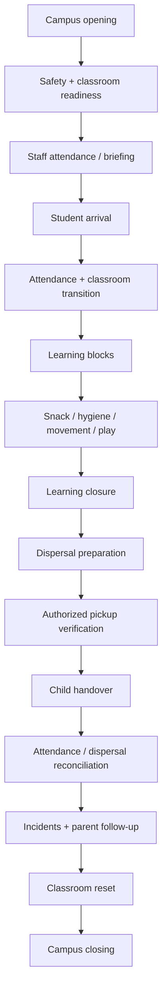

# Daily School Operations

**Status:** Draft v0.1

## Objective

Create a predictable daily operating rhythm that protects children, supports teachers and provides reliable handover and evidence.

## Daily lifecycle

## Opening readiness

Before children enter, verify at minimum:

- access and security readiness
- classrooms safe and prepared
- washrooms and hygiene areas ready
- drinking water / approved child-use facilities ready
- first-aid resources available to authorized staff
- learning materials prepared
- attendance mechanism available
- known facility hazards isolated/escalated

## Arrival controls

- Child is received through the approved handover point.
- Attendance is recorded promptly.
- Relevant authorized staff are made aware of time-sensitive parent information.
- Late arrivals follow the defined late-arrival process rather than bypassing attendance.

## Classroom operating expectations

- Teacher maintains active supervision.
- Activities follow the approved academic plan with reasonable teacher adaptation.
- Child movement between spaces remains supervised.
- Hygiene, snack and washroom routines follow approved safety procedures.
- Incidents and meaningful observations are recorded through the appropriate process.

## Dispersal controls

**No child is released solely because an adult recognizes the child or claims to know the family.** Release must follow the approved authorized-pickup control.

1. Prepare children for dispersal without losing supervision.
2. Verify authorized pickup using the approved mechanism.
3. Complete handover.
4. Record departure where required.
5. Escalate unexpected pickup requests instead of improvising.
6. Reconcile remaining children against attendance/dispersal records.

## Closing controls

- Student count reconciled
- Open incidents handed over
- Parent follow-ups assigned
- Learning materials secured
- Sensitive records/devices secured
- Facility issues logged
- Classroom reset completed
- Campus security closure completed

## Daily operational KPIs

- Attendance completion rate
- Dispersal exception count
- Opening/closing checklist compliance
- Safety incidents and near misses
- Parent follow-up SLA
- Facility issue closure
