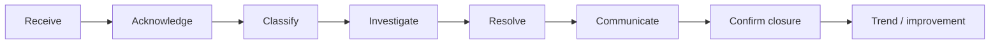

# Parent Experience & Communication

**Status:** Draft v0.1

## Objective

Create a trusted, consistent parent relationship through clear communication, evidence-based progress discussions and disciplined issue resolution.

## Parent lifecycle

`Prospective Parent → Admission → Orientation → Daily Experience → Progress Reviews → Events / Community → Feedback → Re-enrolment / Transition`

## Communication principles

- Child safety and dignity first.
- Use approved channels for operational communication.
- Academic feedback should be specific, constructive and based on observation.
- Do not speculate about medical, developmental or other matters outside staff competence.
- Sensitive child/family information is shared only with authorized recipients and appropriate roles.
- Important complaints, incidents and commitments are recorded rather than retained only in informal chat.

## Communication categories

| Category | Typical owner | Examples |
|---|---|---|
| Operational | Branch/Admin | timings, closures, materials, events |
| Academic | Teacher/Coordinator | learning observations, progress, PTM |
| Attendance | Teacher/Admin | absence, late arrival |
| Finance | Authorized Admin/Finance | fees, receipts, dues |
| Safety / incident | Branch Head / designated role | incidents, emergency communication |
| Complaint | Branch Head / process owner | concern acknowledgement and resolution |

## Complaint lifecycle

## Complaint severity

- **Routine:** normal service or communication issue.
- **Priority:** repeated concern, significant parent dissatisfaction or operational failure.
- **Critical:** child safety/safeguarding, serious injury, privacy/security, legal/regulatory or major reputation risk — escalate immediately through the relevant critical process.

## Parent experience KPIs

- Parent satisfaction / recommendation measure
- PTM participation
- Complaint volume by category
- Acknowledgement and resolution SLA
- Reopened complaints
- Parent communication delivery/read rate where available
- Re-enrolment / retention
