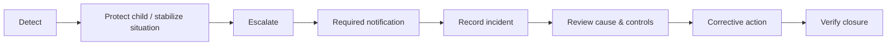

# Child Safety, Safeguarding & Emergency Architecture

**Status:** Foundation — requires jurisdiction-specific professional/legal review before adoption as policy.

## Safety domains

- Child safeguarding and protection
- Authorized pickup and handover
- Visitor management and access control
- Student supervision
- Campus safety checks
- First aid and medical emergency
- Allergy / health information handling
- Accident and incident reporting
- Fire and evacuation
- Missing-child response
- Hygiene and sanitization
- Food / snack safety
- Emergency parent communication
- Emergency closure
- Safety drills and corrective actions

## Safety control principle

Safety processes must identify the responsible adult, verification point, evidence retained, escalation trigger and emergency path. Convenience must never override a mandatory child-safety control.

## Incident lifecycle

> Detailed safeguarding, health, emergency, employment and privacy rules must be aligned to applicable laws, regulations and qualified professional guidance for each operating location.
