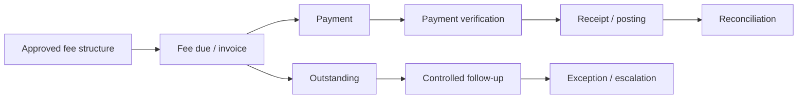

# Finance & Administration Operations

**Status:** Draft v0.1

## Objective

Provide transparent, auditable financial and administrative controls while keeping the parent payment experience simple.

## Core domains

- Approved fee structure
- Fee collection and receipts
- Outstanding fee management
- Discounts / concessions under delegated authority
- Refunds
- Expense approval
- Petty cash
- Budgeting and variance review
- Procurement
- Vendor management
- Inventory and assets
- Monthly financial closure and reporting

## Fee lifecycle

## Core controls

- Only approved fee schedules may be communicated as official fees.
- Discounts/refunds require authority defined by the Delegation of Authority matrix.
- Payment evidence and receipts must be traceable.
- Collections are reconciled against system/bank/cash records as applicable.
- Procurement separates request, approval and receipt verification where practical.
- Assets and inventory have identifiable custodians/records.
- Financial corrections must remain auditable rather than silently replacing history.

## Procurement flow

`Need → Request → Approval → Vendor / Quote → Order → Receive & Verify → Record → Pay → Reconcile`

## KPIs

- Fee collection rate
- Outstanding amount / aging
- Collection reconciliation exceptions
- Budget variance
- Procurement cycle time
- Vendor performance
- Inventory variance
- Unresolved financial exceptions

Tax, accounting, employment and statutory financial requirements must be validated with qualified professionals for each operating entity and location.
