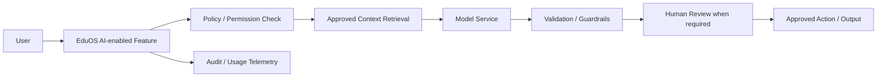

# AI & Automation Architecture

**Status:** Draft v0.1

## Position

AI should assist educators and operations teams, not silently replace accountable human judgment in consequential child, safety, admission, employment or financial decisions.

## Candidate capabilities

- admissions enquiry summarization and follow-up assistance
- lesson-plan assistance grounded in approved Bcube curriculum
- teacher resource discovery
- observation-note organization / summarization
- progress-report drafting for teacher review
- parent FAQ assistance grounded in approved school information
- operational issue summarization
- management narrative generation from approved metrics
- curriculum/content quality checks

## Architecture

## Guardrails

- Ground outputs in approved Bcube sources when factual curriculum/operational guidance is expected.
- Clearly distinguish generated drafts from approved records.
- Require accountable human review before publishing student progress reports or taking consequential actions.
- Minimize sensitive data sent to model providers and define approved data handling before production use.
- Do not infer sensitive characteristics or create unsupported developmental/medical conclusions.
- Maintain traceability to source context where feasible.

## AI decision principle

`Assist → Explain → Human Review → Approve → Record`

Autonomous execution may be appropriate for low-risk administrative automation only after explicit risk assessment and controls.
