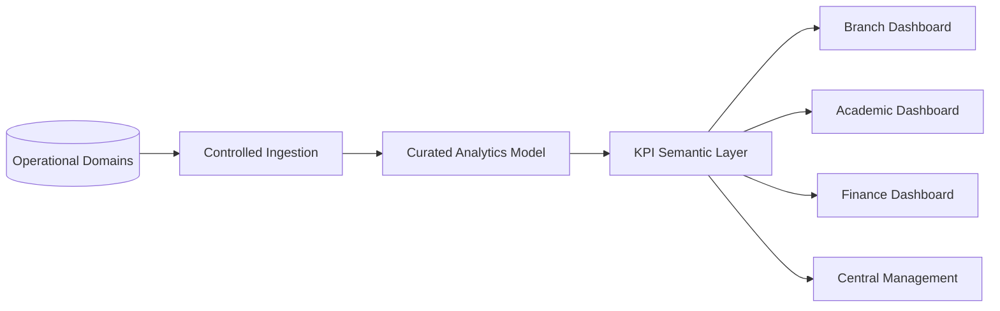

# Analytics Architecture

**Status:** Draft v0.1

## Objective

Provide trusted branch and central reporting without forcing operational applications to become analytics systems.

## Subject areas

- admissions funnel
- enrolment and retention
- attendance
- curriculum delivery
- learning observations / progress coverage
- parent engagement
- staff / teacher quality
- fees and collections
- incidents and operational quality
- branch scorecard

## Metric governance

Every management KPI must define:

`Name → Business definition → Formula → Grain → Source → Owner → Frequency → Target → Threshold → Action`

## Privacy principle

Management analytics should use aggregate data wherever individual-level detail is unnecessary. Access to student-level analytics must remain role/scoped and purpose-appropriate.
