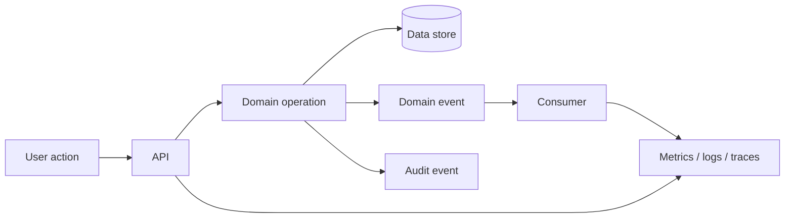

# Observability & Reliability Architecture

**Status:** Draft v0.1

## Goals

- detect failures before they become prolonged school-operation disruption
- trace important workflows across applications/services
- provide auditable evidence for sensitive administrative actions
- distinguish technical failure from business-process exceptions

## Signals

### Metrics
- availability / error rate / latency
- queue or event-delivery health
- notification delivery success
- payment integration success
- login/authentication failures
- workflow completion rates

### Logs
Structured logs should include correlation identifiers and avoid unnecessary sensitive child/family data.

### Traces
Trace multi-service requests for important workflows such as admission, payment, attendance and progress publication.

### Audit events
Keep business/security audit events distinct from diagnostic application logs where appropriate.

## Critical workflow monitoring

## Reliability priorities

Safety-critical school procedures must have documented manual fallbacks. Technology availability must not become a single point of failure for authorized student handover, emergency response or essential supervision.
