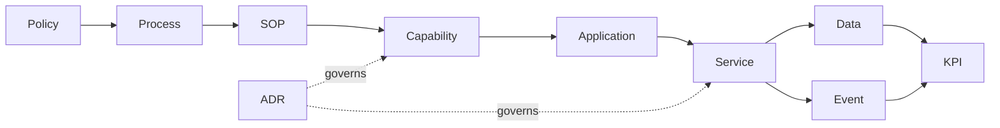

# Operating Process → Technology Capability Mapping

**Status:** Draft v0.1

| Operating process | Primary capability | Supporting capabilities |
|---|---|---|
| Enquiry management | Admissions / CRM | communication, analytics |
| Admission | Admissions + Student Information | document workflow, fees, notifications |
| Student arrival | Attendance | student information, parent notification |
| Authorized dispersal | Attendance / Operations | guardian authorization, audit |
| Weekly lesson planning | Academic Planning | curriculum catalog, teacher workspace |
| Classroom delivery | Teacher Workspace | lesson planning, curriculum references |
| Student observation | Assessment | curriculum objectives, student information |
| Progress reporting | Assessment / Parent Experience | approval workflow, notifications |
| Parent complaint | Parent Engagement | case workflow, communication, analytics |
| Fee collection | Fees / Billing | payment gateway, receipt, analytics |
| Incident management | Safety / Operations | escalation, communication, audit |
| Staff onboarding | People | identity/access, training |
| Branch review | Reporting | analytics / KPI semantic layer |

## Traceability model

## Requirement rule

New technology features should reference the operating process/SOP they support. Likewise, new SOPs requiring system behavior should identify the required capability. This prevents the product architecture and school operating model from drifting apart.
