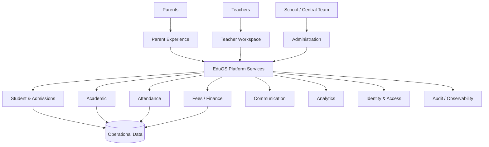

# Preschool Technology Architecture

**Status:** Conceptual foundation

## Goal

Define the digital capabilities that support Bcube Future Preschool without coupling the operating model to a single implementation prematurely.

## Capability landscape

- Parent experience / communication
- Teacher workspace
- School administration
- Admissions / CRM
- Student information
- Attendance
- Academic planning and progress
- Fee / payment management
- Staff operations
- Inventory / assets
- Notifications
- Reporting / analytics
- Identity and access
- Audit / observability

## Conceptual context

## Architecture principles

- Child and parent data protection by design
- Role-based least-privilege access
- Auditable administrative actions
- API-first integration where appropriate
- Avoid duplicating authoritative data
- Operational workflows must continue safely during reasonable technology failures
- Architecture decisions with material long-term impact require ADRs
