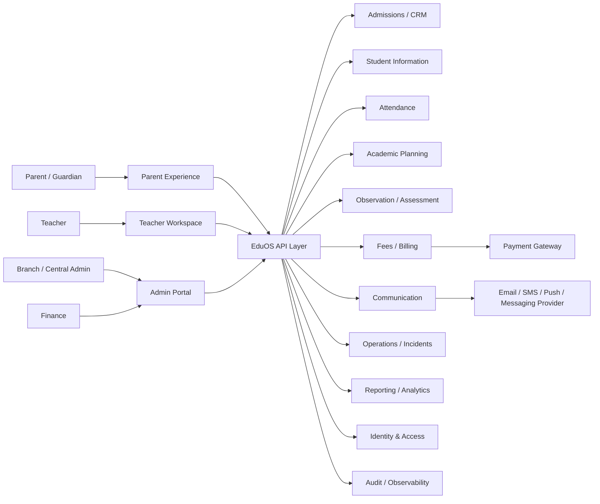

# Preschool Technology System Context

**Status:** Draft v0.1

## Purpose

Define the major users, external systems and platform boundaries that support Bcube Future Preschool operations.

## Architectural boundary

EduOS should coordinate preschool workflows and data while avoiding unnecessary duplication of authoritative information. External providers such as payment, messaging and identity systems should be integrated through well-defined interfaces.

## Core principles

- role-based least privilege
- auditable sensitive actions
- API-first integrations where useful
- offline-safe operational fallbacks for safety-critical school processes
- explicit ownership of each data domain
- traceability from business process to application capability
