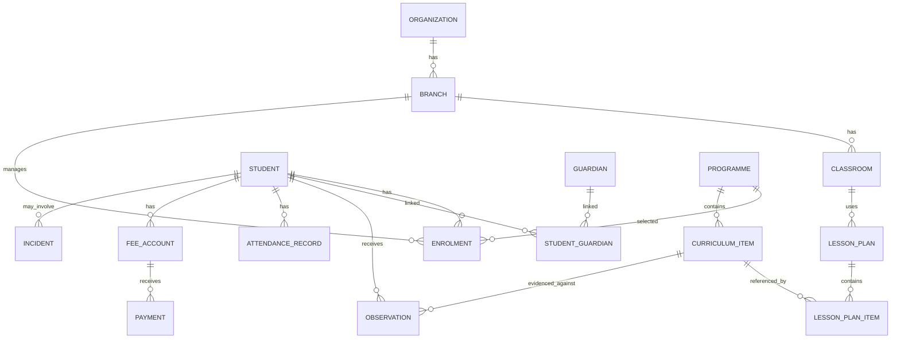

# Core Conceptual Data Model

**Status:** Draft v0.1

## Key modeling choices

### Student versus enrolment
Student identity is separate from enrolment so the same child can move across academic years, programmes, classrooms or branches without recreating the person record.

### Guardian relationship
Guardian is modeled independently with a relationship table because a child can have multiple authorized adults and one adult can be related to multiple children.

### Curriculum versioning
Curriculum references should include immutable/versioned identifiers so historical observations continue to point to the exact learning artifact used at the time.

### Observation versus progress
An observation is evidence captured at a point in time. Progress is a derived/reviewed state based on multiple observations and professional judgment; the two should not be collapsed into one field.
