# Preschool Data Architecture

**Status:** Draft v0.1

## Data domains

| Domain | Example entities | Steward |
|---|---|---|
| Organization | organization, branch, classroom, academic year | Central operations |
| Identity | user, role, permission, session | Technology / security |
| Student | student, enrolment, programme, classroom | School administration |
| Guardian | guardian, relationship, contact, pickup authorization | School administration |
| Admissions | enquiry, visit, application, admission decision | Admissions |
| Academic | programme, series, book, learning objective, lesson plan | Academic team |
| Progress | observation, evidence, outcome status, progress report | Academic team |
| Attendance | attendance session, arrival, absence, dispersal | Branch operations |
| Finance | fee plan, charge, payment, receipt, balance | Finance |
| People | staff, assignment, training, qualification reference | People operations |
| Safety | incident, action, closure, safety check | Branch / safeguarding owner |
| Communication | message, template, recipient, delivery status | Parent experience |
| Inventory | item, stock, issue, asset | Administration |

## Academic traceability model

```mermaid
flowchart LR
  Programme --> Series
  Series --> Book
  Book --> Version
  Version --> Activity[Page / Activity]
  Activity --> Objective[Learning Objective]
  Objective --> Lesson[Lesson Plan]
  Lesson --> Delivery[Delivery Record]
  Delivery --> Observation
  Observation --> Progress[Progress State]
  Progress --> Report[Progress Report]
```

## Data ownership principles

- Every core entity has one authoritative owner.
- Identifiers remain stable even when display names change.
- Historical academic and financial records should retain the version/context under which they were created.
- Sensitive child/family data should be minimized and access-controlled.
- Retention and deletion rules must be defined by data class and applicable requirements before production rollout.
