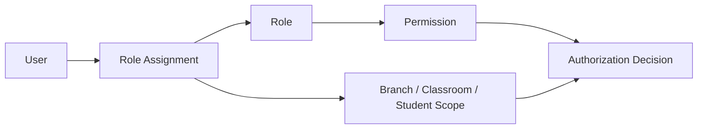

# Role-Based Access Control Model

**Status:** Draft v0.1 — requires security/privacy review before implementation.

## Principles

- least privilege
- deny by default
- branch/data scope in addition to functional role
- privileged actions auditable
- separation of duties for sensitive financial/administrative operations where practical
- access removed promptly when assignment ends

## Conceptual roles

| Role | Typical scope |
|---|---|
| Parent / Guardian | linked child/children only |
| Teacher | assigned classroom / students and approved academic functions |
| Academic Coordinator | assigned branch academic scope |
| Admissions | enquiries/applications for assigned branch(es) |
| Branch Administrator | branch administration excluding restricted central controls |
| Branch Head | broad branch operational visibility and approvals |
| Finance | authorized financial scope |
| Central Academic | curriculum and cross-branch academic governance |
| Central Operations | cross-branch operational governance |
| Platform Administrator | technical administration; business-data access separately controlled |
| Auditor / Reviewer | read-only approved audit scope |

## Permission model

Prefer permissions such as `student.read`, `attendance.record`, `observation.create`, `progress.publish`, `fee.adjust`, `incident.read-sensitive` rather than hard-coding behavior directly to job titles.

## High-risk actions

Examples requiring stronger controls may include fee adjustments/refunds, changes to pickup authorization, access to sensitive incident records, mass exports, role/permission changes and destructive administrative operations.
