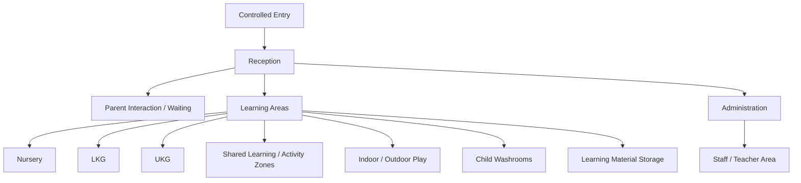

# Preschool Space Architecture

**Status:** Draft concept — dimensions and regulatory requirements must be validated for each location.

## Design objective

Create a child-centered environment that supports learning, movement, supervision, independence, inclusion, hygiene, safeguarding and efficient school operations.

## Functional zones

## Classroom zone model

Depending on room size and programme needs, classrooms should support:
- welcome / group gathering
- literacy / reading
- early maths / manipulatives
- creative / making
- role play / communication
- exploration / discovery
- independent or small-group activity
- accessible material storage
- teacher preparation / controlled storage where needed

Zones should remain flexible; furniture should not create blind spots or prevent safe movement.

## Design principles

- clear supervision sightlines
- child-scale furniture and accessible learning materials
- uncluttered circulation
- rounded / protected hazardous edges where appropriate
- secure storage for restricted materials
- easy-clean surfaces appropriate to use
- calm visual hierarchy rather than excessive decoration
- controlled entry and visitor routing
- age-appropriate washroom access and supervision design
- separation of child-accessible and staff-only / service areas where needed
- accessible emergency routes
- adequate storage to prevent corridors/classrooms becoming cluttered

## Brand application

The physical environment should express Bcube through a coherent palette, typography, signage, learning graphics and Future Skills identity without overwhelming the learning environment. Existing repository design-system assets should remain the source for approved visual standards.

## Design review gates

Concept → Safety/Operations Review → Academic Review → Brand Review → Technical/Services Review → Compliance Review → Design Freeze → As-built Verification.
