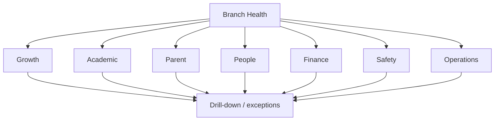

# Branch Management Dashboard Specification

**Status:** Draft v0.1

## Purpose
Provide one management view of growth, learning delivery, parent experience, people, finance, safety and operational control without turning the dashboard into a vanity-metric report.

## Executive scorecard

| Domain | Core measures |
|---|---|
| Enrolment | capacity, active students, new admissions, withdrawals, retention/re-enrolment |
| Admissions | enquiries, visits, applications, admissions, funnel conversion, ageing |
| Attendance | student attendance, unexplained exceptions, staff attendance |
| Academic | curriculum progress, lesson-plan compliance, observation completion, classroom-quality actions |
| Parent | complaints/concerns, resolution SLA, PTM participation, satisfaction/feedback |
| People | staffing vs requirement, vacancies, training completion, observation/performance actions |
| Finance | billed/expected fees, collections, collection %, overdue balance, reconciliation exceptions |
| Safety | incidents by severity, near misses, overdue corrective actions, safety checklist compliance |
| Operations | opening/closing compliance, maintenance issues, inventory exceptions, audit findings |

## Dashboard hierarchy

## KPI specification standard
Every KPI must define:
- Business question answered
- Owner
- Formula
- Numerator / denominator where relevant
- Authoritative source
- Refresh frequency
- Target
- Amber/red threshold
- Allowed filters (branch, programme, level, period)
- Prescribed management action when outside tolerance

## Management cadence
- **Daily:** attendance, safety, staffing, urgent parent/operational exceptions, admissions actions.
- **Weekly:** funnel, academic execution, overdue actions, fee exceptions, parent themes.
- **Monthly:** full branch scorecard, trends, budget/collection, quality, retention, people and corrective actions.

## Data quality controls
A dashboard must not silently treat missing data as zero. Show freshness, completeness and reconciliation exceptions for decision-critical metrics.
