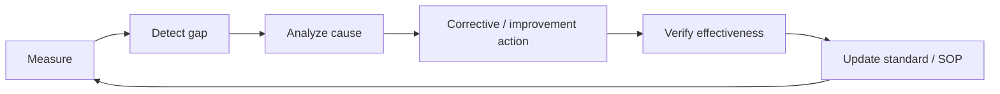

# Quality Management & Analytics

## Quality model

Bcube should measure both **execution quality** and **outcomes**.

## Scorecard domains

### Growth
- Enquiries
- Campus visits
- Applications
- Admissions
- Conversion rate
- Enrolment
- Re-enrolment / retention

### Academic quality
- Lesson-plan compliance
- Curriculum progress
- Student observation / progress completion
- Classroom observation results
- Teacher training completion

### Parent experience
- Parent satisfaction
- Complaints / concerns
- Resolution time
- PTM participation
- Parent engagement

### Operations & safety
- Student attendance
- Staff attendance
- Fee collection rate
- Outstanding fees
- Safety incidents
- Audit findings
- Inventory exceptions
- Corrective-action closure

## Continuous improvement loop

## Metric design rule

Each KPI must have an owner, definition, source, calculation, frequency, target, threshold and prescribed action when outside tolerance.
