# Bcube Future Preschool — Operations & Architecture

> **Status:** Foundation v0.1  
> **Purpose:** Central source of truth for the operating model, academic system, processes, architecture, designs, controls and decisions required to run and scale Bcube Future Preschool.

## Operating principle

Bcube Future Preschool should be **process-driven, measurable and repeatable**, rather than dependent on individual people. Institutional knowledge is retained through policies, processes, SOPs, checklists, templates, architecture documents, decision records and metrics.

## Knowledge architecture

| Area | Purpose |
|---|---|
| [00 Start Here](00-start-here/README.md) | Navigation, document standards and governance |
| [01 Business Architecture](01-business-architecture/README.md) | Vision, model, value proposition and growth |
| [02 Organization](02-organization/README.md) | Organization, roles, RACI and authority |
| [03 Operating Model](03-operating-model/README.md) | Preschool operating model and lifecycle |
| [04 Academic Architecture](04-academic-architecture/README.md) | Learning philosophy, levels and academic delivery |
| [05 Curriculum](05-curriculum/README.md) | Curriculum architecture and Bcube learning system |
| [06 Admissions](06-admissions/README.md) | Enquiry-to-enrolment lifecycle |
| [07 Daily Operations](07-daily-operations/README.md) | Opening, attendance, classroom flow and dispersal |
| [08 Parent Experience](08-parent-experience/README.md) | Communication, PTMs, feedback and complaints |
| [09 People](09-people/README.md) | Recruitment, onboarding, training and performance |
| [10 Safety](10-safety/README.md) | Safeguarding, access, incidents and emergency controls |
| [11 Finance](11-finance/README.md) | Fees, expenses, procurement and controls |
| [12 Technology](12-technology/README.md) | System, application and integration architecture |
| [13 Data & Security](13-data-security/README.md) | Data architecture, privacy, access and retention |
| [14 Brand & Space Design](14-brand-space-design/README.md) | Brand, learning environment and preschool space design |
| [15 Branch Expansion](15-branch-expansion/README.md) | Site-to-launch repeatable branch setup |
| [16 Quality & Analytics](16-quality-analytics/README.md) | Audits, KPIs, scorecards and continuous improvement |
| [17 Governance](17-governance/README.md) | Policy, compliance, approvals and change management |
| [SOP Library](sop/README.md) | Standard operating procedures |
| [Templates](templates/README.md) | Controlled document templates |
| [Architecture Decisions](adr/README.md) | Why important decisions were made |

## End-to-end student lifecycle

```mermaid
flowchart LR
    E[Enquiry] --> C[Counselling]
    C --> V[Campus Visit]
    V --> A[Application]
    A --> AD[Admission]
    AD --> O[Parent Orientation]
    O --> ON[Student Onboarding]
    ON --> L[Learning]
    L --> AS[Assessment]
    AS --> PR[Progress Review]
    PR --> RE[Re-enrolment / Transition]
```

## Documentation layers

1. **Architecture** — how the overall system is designed.
2. **Policy** — rules and mandatory boundaries.
3. **Process** — end-to-end business flow and ownership.
4. **SOP** — exact repeatable execution procedure.
5. **Checklist** — execution control at the point of work.
6. **Form / Register** — evidence and operational records.
7. **KPI / Dashboard** — measurement and management control.
8. **ADR** — context, alternatives and rationale behind significant decisions.

## Document lifecycle

`Draft → Review → Approved → Active → Deprecated → Archived`

## Version convention

- `v0.x` — draft / evolving design
- `v1.0` — first approved operational version
- `v1.x` — backward-compatible improvement
- `v2.0+` — material operating or architecture change

## Relationship to existing EduOS assets

This namespace describes **preschool operations and organizational architecture**. Existing repository areas such as `curriculum/`, `design-system/`, `bcube-publishing-engine-v5/`, `bcube-publishing-sdk/` and existing `docs/` remain authoritative for their respective implementation and publishing concerns. Preschool documentation should link to those sources instead of duplicating them.
