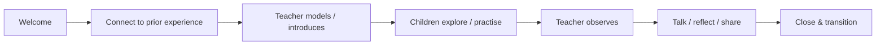

# SOP-ACA-005 — Classroom Delivery

**Status:** Draft v0.1

## Purpose
Provide a predictable but flexible classroom delivery model centered on active child participation.

## Default learning loop

## Teacher expectations
1. Prepare the environment and materials before children begin.
2. State or demonstrate the learning purpose in child-friendly language.
3. Model only enough to enable participation; avoid turning the activity into prolonged teacher talk.
4. Give children meaningful opportunities to speak, choose, manipulate, create, compare, solve, move or demonstrate as relevant.
5. Observe individual responses and misconceptions.
6. Support children using prompts, modelling, repetition or simplified steps without doing the task for them.
7. Use positive, specific feedback focused on effort, strategy, communication and progress.
8. Close with a short reflection or observable check.
9. Record material learning observations that affect future planning.

## Controls
- Maintain active supervision and safe movement/material use.
- Avoid public ranking, humiliation or comparison of children.
- Do not force a child to perform publicly as proof of learning.
- Classroom evidence should reflect child participation rather than teacher-produced work.

## Evidence
Lesson/weekly-plan reference, attendance, relevant observation notes and completion/progress records.
