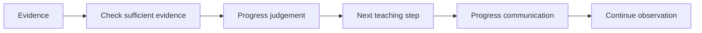

# SOP-ACA-008 — Assessment & Progress Review

**Status:** Draft v0.1

## Purpose
Provide a balanced, evidence-based view of each child's progress that informs teaching and parent communication.

## Evidence sources
- classroom observation
- conversation / oral response
- play and practical demonstration
- child-created work
- workbook/activity evidence where appropriate
- repeated performance across contexts

## Review process

## Procedure
1. Review evidence against approved programme learning outcomes.
2. Check for gaps caused by absence or insufficient opportunity before judging progress.
3. Use the controlled progress scale consistently.
4. Identify strengths and next learning steps.
5. Flag material concerns for academic review before formal parent communication.
6. Agree classroom adaptations/support and a review point.
7. Prepare progress communication using specific, understandable examples.

## Controls
- Do not convert preschool assessment into high-stakes ranking.
- Avoid unsupported predictions about future academic ability.
- Progress records must be treated as child data and access-controlled.
- Any specialized developmental concern should be communicated carefully and referred through appropriate professional pathways.
