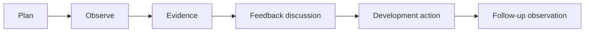

# SOP-ACA-010 — Teacher Classroom Observation

**Status:** Draft v0.1  
**Owner:** Academic Coordinator / Academic Head

## Purpose
Improve teaching quality through structured observation, evidence and coaching rather than punitive inspection.

## Observation dimensions
1. Planning and objective clarity
2. Environment/material readiness
3. Child engagement and participation
4. Communication and questioning
5. Modelling and instructions
6. Differentiation/support
7. Observation of children's learning
8. Classroom routines and transitions
9. Positive behaviour guidance
10. Safety/supervision
11. Closure/reflection
12. Alignment to approved curriculum

## Process

## Procedure
1. Define observation scope and use the approved rubric.
2. Observe enough of the learning sequence to understand context.
3. Record factual examples, not personality judgments.
4. Identify strengths first, then a limited number of high-value improvement actions.
5. Discuss evidence with the teacher and allow context/clarification.
6. Agree actions, support required, owner and review date.
7. Follow up and record whether the change improved classroom practice.

## Escalation
Immediate safety or safeguarding concerns bypass normal coaching cadence and follow the relevant safety escalation process.

## KPIs
- observation completion
- coaching-action closure
- repeat finding rate
- teacher-development completion
- trend in rubric dimensions
