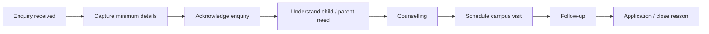

# SOP-ADM-001 — Enquiry Management

**Status:** Draft v0.1  
**Owner:** Admissions Lead / Branch Head

## Purpose
Convert every genuine preschool enquiry into a traceable next action while providing a consistent, helpful parent experience.

## Flow

## Procedure
1. Record enquiry source, parent/guardian name, contact channel, child age/date of birth where voluntarily provided, desired programme/academic year and preferred branch.
2. Assign an enquiry owner and status.
3. Acknowledge the enquiry through the agreed communication channel.
4. Understand programme fit, expected start date and parent questions without making unsupported commitments.
5. Offer counselling and a campus visit where appropriate.
6. Record every meaningful follow-up and the next-action date.
7. When the family proceeds, link the enquiry to the application/admission record.
8. When the enquiry closes, record a standardized close reason.

## Controls
- Avoid collecting unnecessary child/family data at the enquiry stage.
- Do not promise admission, discounts, transport, special support or facilities until authorized.
- Marketing consent and operational communication should be distinguished where applicable.
- Duplicate enquiries should be consolidated rather than counted as separate prospects.

## Evidence
Enquiry record, source, owner, status, interaction history, next action and final disposition.

## KPIs
- First-response time
- Enquiry-to-visit conversion
- Visit-to-application conversion
- Application-to-admission conversion
- Follow-up SLA compliance
- Lost-enquiry reasons
