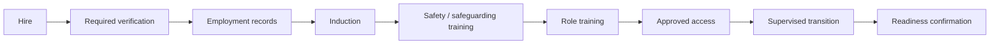

# SOP-HR-003 — Staff & Teacher Onboarding

**Status:** Draft v0.1  
**Owner:** People Operations / Branch Head

## Objective
No employee should begin unsupervised responsibilities until required employment, role, safety, safeguarding, access and induction controls are complete.

## Flow

## Onboarding checklist
1. Confirm approved role, reporting line, start date and employment documentation.
2. Complete required identity/background/reference verification under applicable law and policy.
3. Capture emergency and payroll/administrative information using approved data controls.
4. Provide code of conduct, child-safeguarding, safety, privacy and incident-reporting induction.
5. Train role-specific procedures before independent execution.
6. Provision only the physical/system access required for the role.
7. For teachers, cover academic philosophy, curriculum, classroom routines, observation/assessment, parent communication and classroom safety.
8. Use supervised observation/shadowing where required.
9. Confirm onboarding completion and outstanding actions.
10. Conduct an early-stage review during the defined probation/settling period.

## Evidence
Employment checklist; verification status; policy acknowledgements; training records; access approvals; readiness sign-off.

## KPIs
Onboarding completion before independent duty; mandatory training completion; access exceptions; early attrition; probation outcomes.
