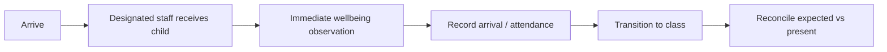

# SOP-STU-001 — Student Arrival

**Status:** Draft v0.1 — safety-sensitive; validate locally before activation.  
**Owner:** Branch Head / Designated Arrival Lead

## Purpose
Provide a calm, traceable and safe transition from the responsible adult to school supervision.

## Flow

## Procedure
1. Designated staff take position before the arrival window begins.
2. Receive each child at the approved handover point; avoid uncontrolled entry into child areas.
3. Observe obvious immediate wellbeing concerns and follow the approved health/escalation process when needed.
4. Record attendance/arrival promptly in the authoritative register/system.
5. Transition the child to the responsible classroom team.
6. After the arrival window, reconcile classroom presence against recorded attendance.
7. Investigate discrepancies immediately; absence follow-up follows the approved branch policy.

## Controls
- A child is never considered under school supervision until handover is complete.
- Attendance records must reflect actual presence, not assumptions or expected schedules.
- Unexplained attendance discrepancies require immediate resolution.
- Late arrivals follow the controlled late-arrival path rather than bypassing reception/attendance.

## Evidence
Arrival/attendance record; exception or incident record where applicable.

## KPIs
Attendance accuracy; unresolved reconciliation exceptions; late-arrival frequency; arrival incidents.
