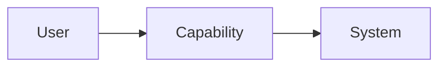

# <Domain / System> Architecture

| Field | Value |
|---|---|
| Owner | <Role> |
| Status | Draft |
| Version | 0.1 |
| Last reviewed | TBD |

## Purpose

Define the architecture, boundaries and key design decisions for this domain.

## Context

What problem or capability does this architecture address?

## Scope

### In scope
- ...

### Out of scope
- ...

## Principles

- ...

## Context diagram

## Components

| Component | Responsibility | Owner |
|---|---|---|
| <Component> | <Responsibility> | <Role> |

## Process / data flows

Document major flows with Mermaid diagrams where useful.

## Interfaces & dependencies

- ...

## Security, privacy & safety

- Access model
- Sensitive data
- Auditability
- Safety considerations

## Non-functional requirements

- Availability
- Performance
- Reliability
- Scalability
- Maintainability
- Observability

## Risks & trade-offs

| Risk / trade-off | Impact | Mitigation |
|---|---|---|
| ... | ... | ... |

## Decisions

Link relevant ADRs.

## Roadmap

- Current
- Next
- Future
